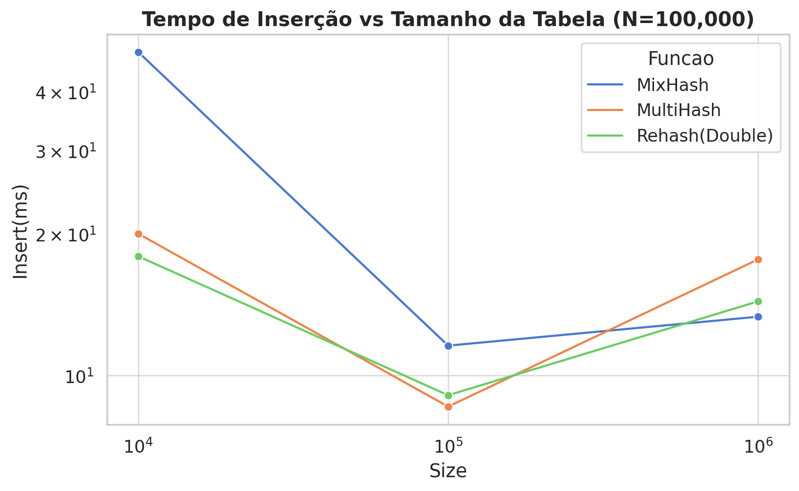
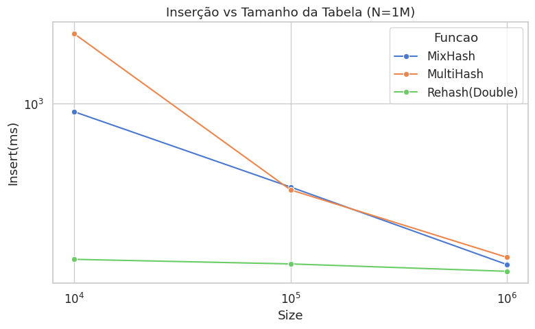
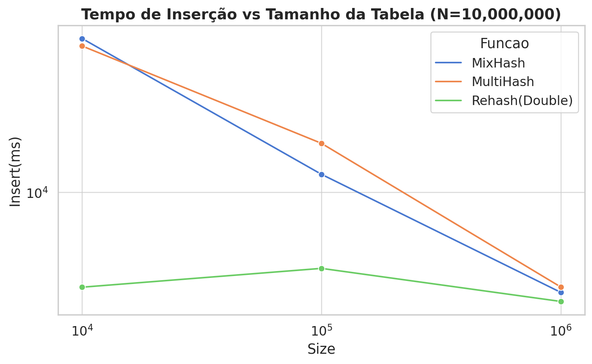
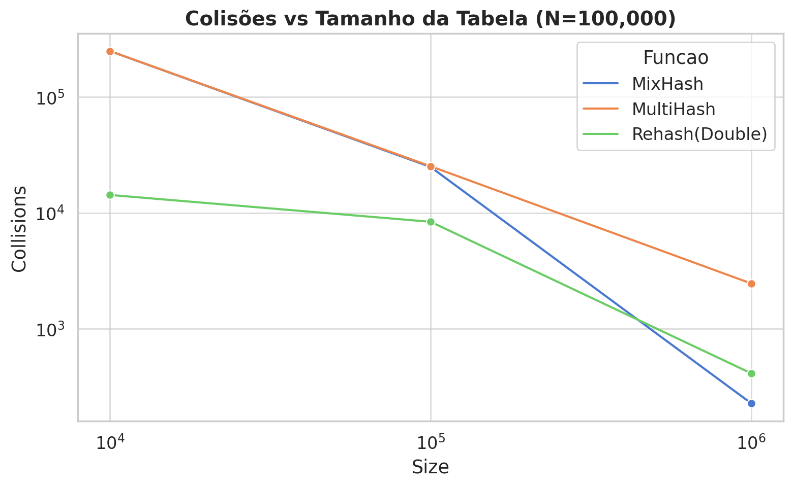
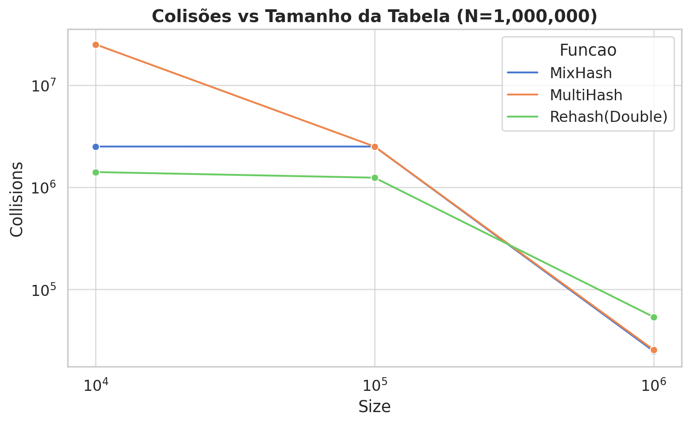
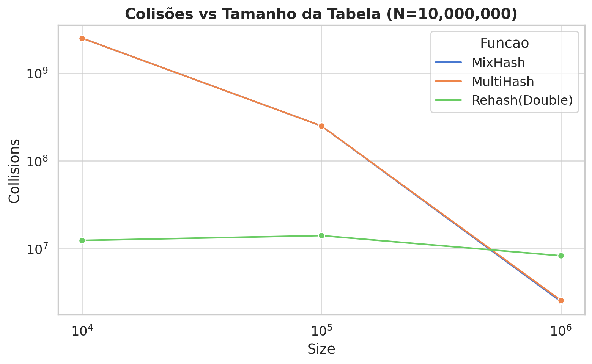
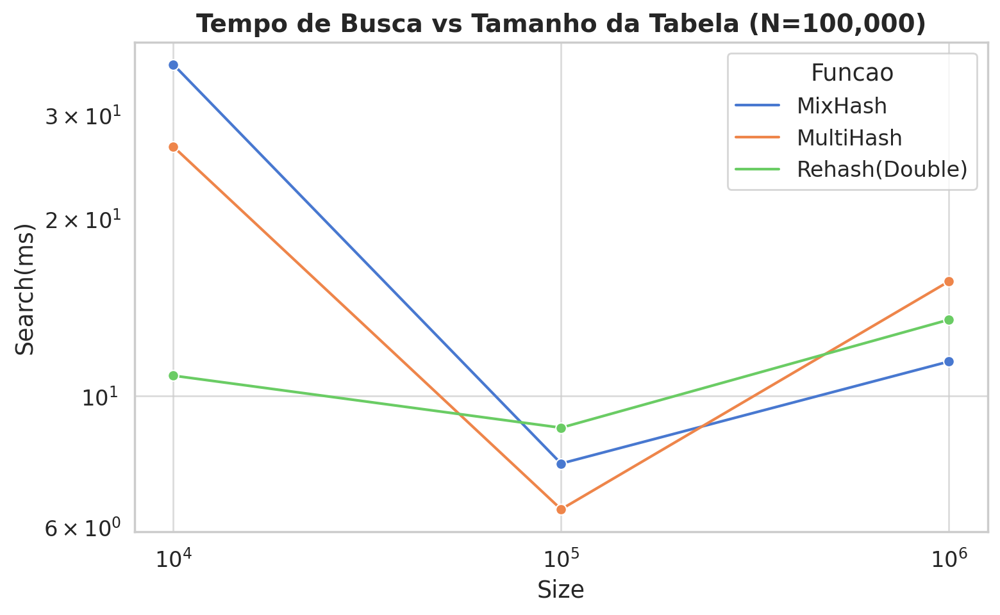
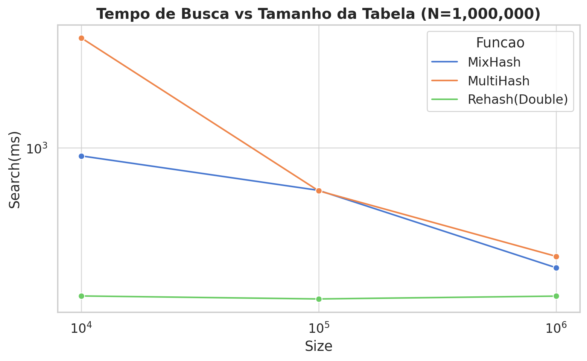

# Relatório de desempenho funções Hash

- Com os dados gerados pelo código, pegamos o output "benchmark_report_seed10.txt", tranformamos os dados em um CSV e dentro de um notebook no Google Colab, com matplotlib, seaborn e pandas fizemos as diferentes análises: 

## Tempo para inserção e tamanho de tabela:
#### Quando temos a inserção de 100 mil de elementos: 
 
- MixHash é mais lenta em vetor=10k devido a mais colisões. E Rehash(Double) se mantém rápido por causa do baixo fator de carga. 
#### Quando temos a inserção de 1 milhão de elementos: 

- Vemos que Rehash é muito mais rápida que os outros dois métodos pois utiliza endereçamento aberto ao invés de criar ou estrutura de dados para lidar com as colisões (lista encadeada). 
#### Quando temos a inserção de 10 milhões de elementos: 

- Todos os tempos são significativamente maiores, porém a função Rehash é superior quando o tamanho do vetor é grande o suficiente para evitar tantos resizes.

## Colisões e tamanho de tabela: 
#### Quantidade de colisões com inserção de 100 mil de elementos: 
 
- MixHash e MultiHash colidem bastante com o vetor de 10k, mas diminuem drasticamente com vetores de 100k e 1M. Rehash(Double) já começa com poucas colisões mesmo em vetores menores.
#### Quantidade de colisões com inserção de 1 milhão de elementos: 

- MultiHash acaba tendo mais colisões no menor vetor, MixHash acaba sendo um pouco mais estável porém continua com alto nível de colisões. Rehash é estável nesse ponto. 
#### Quantidade de colisões com inserção de 10 milhões de elementos: 

- MultiHash e MixHash explodem em colisões pela quantidade de dados passar muito o tamanho do vetor, já Rehash(Double) continua eficiente, mesmo com carga alta, por causa do redimensionamento automático.

## Tempo de busca e tamanho de tabela: 
#### Velocidade de busca de 100 mil de elementos: 
 
- MixHash é a mais lenta quando o vetor é menor, devido ao custo da lista encadeada com colisões.Rehash(Double) se mantém muito estável com tempo baixo em todas as tabelas por ser linear, e MultiHash melhora drasticamente quando o vetor aumenta. 
#### Velocidade de busca de de 1 milhão de elementos: 

- O aumento do vetor reduz significativamente o tempo de busca para todas as funções. Rehash(Double) segue com melhor desempenho, pois busca direto nos slots.
#### Velocidade de busca de de 10 milhões de elementos: 

- Custo explode para MixHash e MultiHash com vetores 10k e 100k, pois as listas são largas (buckets grandes). 